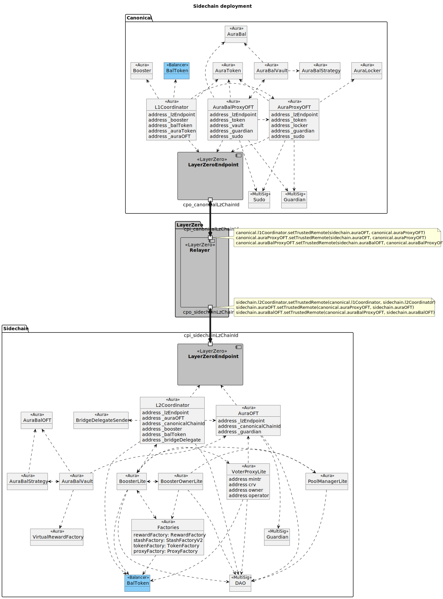

# Aura Sidechain

Aura sidechain contracts

## Contracts

```
contracts/sidechain
├── AuraBalProxyOFT.sol     L1 Aura BAL proxy OFT
├── AuraBalOFT.sol          L2 Aura BAL OFT
├── AuraProxyOFT.sol        L1 Aura proxy OFT
├── AuraOFT.sol             L2 Aura OFT
├── Create2Factory.sol      A create2 factory to deploy the sidechain contracts to constant addresses
├── CrossChainConfig.sol    Abstract contract to handle setting LZ configs
├── CrossChainMessages.sol  Shared LZ messaging library
├── L1Coordinator.sol       L1 Coordinator handles sending messages to canonical chain
├── L2Coordinator.sol       L2 Coordinator handles sending messages to canonical chain
├── PausableOFT.sol         OFT extension  that allows a `guardian` address to perform an emergency pause
├── PausableProxyOFT.sol    Proxy OFT extension  that allows a `guardian` address to perform an emergency pause
└── PauseGuardian.sol       Allows to implement pauses triggered by a `guardian` address
```

## Deployment Tasks

### Phase 1

Deployment of sidechain pools (Booster, VoterProxy etc) and the Aura OFT.

1. Deploy the first phase of L1 sidechain system (AuraProxyOFT, L1Coordinator)

```
yarn task deploy:sidechain:L1:phase1 --wait <WAIT_N_BLOCKS>
```

2. Deploy the first phase of sidechain L2 system. (BoosterLite, VoterProxyLite, ... etc)

```
yarn task deploy:sidechain:L2:phase1 --wait <WAIT_N_BLOCKS>
```

3. Set the config and trusted remotes for the canonical chain

```
yarn task deploy:sidechain:config:L1:phase1 --wait <WAIT_N_BLOCKS> --sidechainid <CHAIN_ID> --network <CANONICAL_NETWORK_NAME>
```

### Phase 2

1. Deploy the second phase of L1 sidechain system (AuraBalProxyOFT)

```
yarn task deploy:sidechain:L1:phase2 --wait <WAIT_N_BLOCKS>
```

2. Deploy the second phase of sidechain L2 system. (AuraBalOFT)

```
yarn task deploy:sidechain:L2:phase2 --wait <WAIT_N_BLOCKS>
```

3. Set the config and trusted remotes for the canonical chain

```
yarn task deploy:sidechain:config:L1:phase2 --wait <WAIT_N_BLOCKS> --sidechainid <CHAIN_ID> --network <CANONICAL_NETWORK_NAME>
```

## Other Tasks

#### Mock contracts

Deploy mock contracts onto an L2 where Balancer is not deployed.

```
yarn task deploy:sidechain:mocks --wait <WAIT_N_BLOCKS>
```

#### Create2

Deploy a single instance of the create2Factory

```
yarn task deploy:sidechain:create2Factory --wait <WAIT_N_BLOCKS>
```

Compute L2 contract addresses

```
yarn task sidechain:addresses --chainId <CHAIN_ID>
```

#### LayerZero tasks

Lookup OFT information for a local->remote chain. It is also required that the environment variable REMOTE_NODE_URL is set.

For example if I want to lookup the information of mainnet->arbitrum I would set NODE_URL to a mainnet RPC and
REMOTE_NODE_URL to an arbitrum RPC and then pass in the arbitrum chain ID as sidechainid

```
yarn task sidechain:aura-oft-info --sidechainid <SIDECHAIN_ID>
```

Send AURA to a sidechain by providing a sidechain ID. Can also set force to true to ignore the chain ID sanity check when sending AURA between deployments running on the same chain. This is useful when testing

```
yarn task sidechain:test:send-aura-to-sidechain \
  --wait <WAIT_N_BLOCKS> \
  --amount <AMOUNT_OF_AURA> \
  --sidechainid <SIDECHAIN_ID> \
  --force <IGNORE_SIDECHAIN_CHECK>
```

Lock AURA from a sidechain

```
yarn task sidechhain:test:lock-aura --wait <WAIT_N_BLOCKS> --amount <AMOUNT_TO_LOCK>
```

## Deployments

#### Ethereum Mainnet (1)

| Contract                          | Address                                                                                                               |
| --------------------------------- | --------------------------------------------------------------------------------------------------------------------- |
| L1Coordinator                     | [0xaA54f3b282805822419265208e669d12372a3811](https://etherscan.io/address/0xaA54f3b282805822419265208e669d12372a3811) |
| AuraProxyOFT (ProxyOFT)           | [0xB401f0cff9F05d10699c0e2c88a81dD923c1FFFf](https://etherscan.io/address/0xB401f0cff9F05d10699c0e2c88a81dD923c1FFFf) |
| AuraBalProxyOFT (ProxyOFT)        | [0xdF9080B6BfE4630a97A0655C0016E0e9B43a7C68](https://etherscan.io/address/0xdF9080B6BfE4630a97A0655C0016E0e9B43a7C68) |
| TestDistributeAura                | [0xc9e61174B8751003f493D25c2Ef49794aB6b1aC7](https://etherscan.io/address/0xc9e61174B8751003f493D25c2Ef49794aB6b1aC7) |
| BridgeDelegateReceiver (Arbitrum) | [0x397A2D4d23C6fD1316cE25000820779006e80cD7](https://etherscan.io/address/0x397A2D4d23C6fD1316cE25000820779006e80cD7) |
| BridgeDelegateReceiver (Optimism) | [0x60421ffaa36f3a8e69c25887e575689f52b055f7](https://etherscan.io/address/0x60421ffaa36f3a8e69c25887e575689f52b055f7) |
| BridgeDelegateReceiver (Gnosis)   | [0xac962acd42f93c6f26e1cf83271d2a53b208daa6](https://etherscan.io/address/0xac962acd42f93c6f26e1cf83271d2a53b208daa6) |
| BridgeDelegateReceiver (Polygon)  | [0x25e7C574c4016e09F608971F97c3B09A6cf4F669](https://etherscan.io/address/0x25e7C574c4016e09F608971F97c3B09A6cf4F669) |
| BridgeDelegateReceiver (Base)     | [0x7eB87C3a4eabDaD158781d0dbB7Ab3589B9C2B4C](https://etherscan.io/address/0x7eB87C3a4eabDaD158781d0dbB7Ab3589B9C2B4C) |
| BridgeDelegateReceiver (ZkEvm)    | [0xBcF3B107a5ECDD8Efb70a74f44b827a1F7108c48](https://etherscan.io/address/0xBcF3B107a5ECDD8Efb70a74f44b827a1F7108c48) |
| Sudo                              | [0xb370Ebd7ded0c87b4509FF6f13F07B7F1693Bf46](https://etherscan.io/address/0xb370Ebd7ded0c87b4509FF6f13F07B7F1693Bf46) |
| View                              | [0x208024E643564fb4C990481eB4F9ec1957f64c11](https://etherscan.io/address/0x208024E643564fb4C990481eB4F9ec1957f64c11) |
| AuraDistributor                   | [0x96D15D08538A17A03B0210FD1626D5f42bdba9a4](https://etherscan.io/address/0x96D15D08538A17A03B0210FD1626D5f42bdba9a4) |

#### Arbitrum (42161)

| Contract                 | Address                                                                                                              |
| ------------------------ | -------------------------------------------------------------------------------------------------------------------- |
| create2Factory           | [0x53C09096b1dC52e2Ef223b2969a714eE75Da364f](https://arbiscan.io/address/0x53C09096b1dC52e2Ef223b2969a714eE75Da364f) |
| L2Coordinator            | [0xeC1c780A275438916E7CEb174D80878f29580606](https://arbiscan.io/address/0xeC1c780A275438916E7CEb174D80878f29580606) |
| AuraOFT                  | [0x1509706a6c66CA549ff0cB464de88231DDBe213B](https://arbiscan.io/address/0x1509706a6c66CA549ff0cB464de88231DDBe213B) |
| AuraBalOFT               | [0x223738a747383d6F9f827d95964e4d8E8AC754cE](https://arbiscan.io/address/0x223738a747383d6F9f827d95964e4d8E8AC754cE) |
| AuraBalVault             | [0x4EA9317D90b61fc28C418C247ad0CA8939Bbb0e9](https://arbiscan.io/address/0x4EA9317D90b61fc28C418C247ad0CA8939Bbb0e9) |
| AuraBalStrategy          | [0x4B5D2848678Db574Fbc2d2f629143d969a4f41Cb](https://arbiscan.io/address/0x4B5D2848678Db574Fbc2d2f629143d969a4f41Cb) |
| VirtualRewardsFactory    | [0x05589CbbE1cC0357986DF6de4031B953819079c2](https://arbiscan.io/address/0x05589CbbE1cC0357986DF6de4031B953819079c2) |
| BoosterLite              | [0x98Ef32edd24e2c92525E59afc4475C1242a30184](https://arbiscan.io/address/0x98Ef32edd24e2c92525E59afc4475C1242a30184) |
| VoterProxyLite           | [0xC181Edc719480bd089b94647c2Dc504e2700a2B0](https://arbiscan.io/address/0xC181Edc719480bd089b94647c2Dc504e2700a2B0) |
| TokenFactory             | [0x87299312C820607f1E7E4d0c6715CEB594306FE9](https://arbiscan.io/address/0x87299312C820607f1E7E4d0c6715CEB594306FE9) |
| ProxyFactory             | [0x731886426a3199b988194831031dfb993F25D961](https://arbiscan.io/address/0x731886426a3199b988194831031dfb993F25D961) |
| RewardFactory            | [0xda2e6bA0B1aBBCA925b70E9747AFbD481C16e7dB](https://arbiscan.io/address/0xda2e6bA0B1aBBCA925b70E9747AFbD481C16e7dB) |
| StashFactory             | [0x779aa2880d7a701FB46d320C710944a72E2A049b](https://arbiscan.io/address/0x779aa2880d7a701FB46d320C710944a72E2A049b) |
| PoolManagerLite          | [0xf24074a1A6ad620aDC14745F9cc1fB1e7BA6CA71](https://arbiscan.io/address/0xf24074a1A6ad620aDC14745F9cc1fB1e7BA6CA71) |
| BoosterOwner             | [0x3af95Ba5C362075Bb28E5A2A42D7Cd1e201A1b66](https://arbiscan.io/address/0x3af95Ba5C362075Bb28E5A2A42D7Cd1e201A1b66) |
| ProtocolDAO              | [0xD1A6e8cA5D4d6C1fA0CD1f6937A49D3f380DAc62](https://arbiscan.io/address/0xD1A6e8cA5D4d6C1fA0CD1f6937A49D3f380DAc62) |
| ClaimZap                 | [0x617963D46B882ecE880Ab18Bc232f513E91FDd47](https://arbiscan.io/address/0x617963D46B882ecE880Ab18Bc232f513E91FDd47) |
| Treasury                 | [0x57ACb721FcF3d900B480A90A55191CF8F37ad478](https://arbiscan.io/address/0x57ACb721FcF3d900B480A90A55191CF8F37ad478) |
| RewardPoolDepositWrapper | [0x6b02fEFd2F2e06f51E17b7d5b8B20D75fd6916be](https://arbiscan.io/address/0x6b02fEFd2F2e06f51E17b7d5b8B20D75fd6916be) |
| BridgeSender             | [0xdE386aeDEC27521daF1f8a49C03aDa7C158455Bf](https://arbiscan.io/address/0xdE386aeDEC27521daF1f8a49C03aDa7C158455Bf) |
| View                     | [0x0a6bcB3a0C03aB2Bc8A058ee02ed11D50b494083](https://arbiscan.io/address/0x0a6bcB3a0C03aB2Bc8A058ee02ed11D50b494083) |
| KeeperMulticall3         | [0x5C97f09506d60B90a817EB547ea4F03Ae990E798](https://arbiscan.io/address/0x5C97f09506d60B90a817EB547ea4F03Ae990E798) |
| ChildStashRewardDistro   | [0xcA85e2cE206b48ee28A87b0a06f9519ABE627451](https://arbiscan.io/address/0xcA85e2cE206b48ee28A87b0a06f9519ABE627451) |
| ChildGaugeVoteRewards    | [0x2863582272A424234FcE76d97099AcBd432acC01](https://arbiscan.io/address/0x2863582272A424234FcE76d97099AcBd432acC01) |
| ExtraRewardStashModule   | [0x81054Eb2dA118651aD41BF5CA7404440A018b681](https://arbiscan.io/address/0x81054Eb2dA118651aD41BF5CA7404440A018b681) |

#### Optimism (10)

| Contract                 | Address                                                                                                                          |
| ------------------------ | -------------------------------------------------------------------------------------------------------------------------------- |
| create2Factory           | [0x53C09096b1dC52e2Ef223b2969a714eE75Da364f](https://optimistic.etherscan.io/address/0x53C09096b1dC52e2Ef223b2969a714eE75Da364f) |
| L2Coordinator            | [0xeC1c780A275438916E7CEb174D80878f29580606](https://optimistic.etherscan.io/address/0xeC1c780A275438916E7CEb174D80878f29580606) |
| AuraOFT                  | [0x1509706a6c66CA549ff0cB464de88231DDBe213B](https://optimistic.etherscan.io/address/0x1509706a6c66CA549ff0cB464de88231DDBe213B) |
| BoosterLite              | [0x98Ef32edd24e2c92525E59afc4475C1242a30184](https://optimistic.etherscan.io/address/0x98Ef32edd24e2c92525E59afc4475C1242a30184) |
| KeeperMulticall3         | [0x37aA9Ad9744D0686df1C7053225e700ce13e31Dd](https://optimistic.etherscan.io/address/0x37aA9Ad9744D0686df1C7053225e700ce13e31Dd) |
| VoterProxyLite           | [0xC181Edc719480bd089b94647c2Dc504e2700a2B0](https://optimistic.etherscan.io/address/0xC181Edc719480bd089b94647c2Dc504e2700a2B0) |
| TokenFactory             | [0x87299312C820607f1E7E4d0c6715CEB594306FE9](https://optimistic.etherscan.io/address/0x87299312C820607f1E7E4d0c6715CEB594306FE9) |
| ProxyFactory             | [0x731886426a3199b988194831031dfb993F25D961](https://optimistic.etherscan.io/address/0x731886426a3199b988194831031dfb993F25D961) |
| RewardFactory            | [0x2F4CdF0D46F4E3E6D4d37836E73073046138D4f7](https://optimistic.etherscan.io/address/0x2F4CdF0D46F4E3E6D4d37836E73073046138D4f7) |
| StashFactory             | [0x8401B48760E70A39e6bBf861ABd050c00362bAE8](https://optimistic.etherscan.io/address/0x8401B48760E70A39e6bBf861ABd050c00362bAE8) |
| PoolManagerLite          | [0xf24074a1A6ad620aDC14745F9cc1fB1e7BA6CA71](https://optimistic.etherscan.io/address/0xf24074a1A6ad620aDC14745F9cc1fB1e7BA6CA71) |
| BoosterOwner             | [0xF044eE152C7D731825280350D876CF760181D96F](https://optimistic.etherscan.io/address/0xF044eE152C7D731825280350D876CF760181D96F) |
| ProtocolDAO              | [0xD86CEB76e9430D3bDE90ded79c82Ae62bc66d68b](https://optimistic.etherscan.io/address/0xD86CEB76e9430D3bDE90ded79c82Ae62bc66d68b) |
| ClaimZap                 | [0x617963D46B882ecE880Ab18Bc232f513E91FDd47](https://optimistic.etherscan.io/address/0x617963D46B882ecE880Ab18Bc232f513E91FDd47) |
| Treasury                 | [0x57ACb721FcF3d900B480A90A55191CF8F37ad478](https://optimistic.etherscan.io/address/0x57ACb721FcF3d900B480A90A55191CF8F37ad478) |
| RewardPoolDepositWrapper | [0x51b6e0ac6D6435650748513C71db453F96749fe1](https://optimistic.etherscan.io/address/0x51b6e0ac6D6435650748513C71db453F96749fe1) |
| BridgeSender             | [0x7E702E51142eb7658CE4cE734C9bDec74250f265](https://optimistic.etherscan.io/address/0x7E702E51142eb7658CE4cE734C9bDec74250f265) |
| View                     | [0xFa6B857cC17740A946c9eb85C1a6896f2e0Be98E](https://optimistic.etherscan.io/address/0xFa6B857cC17740A946c9eb85C1a6896f2e0Be98E) |
| ChildStashRewardDistro   | [0xcA85e2cE206b48ee28A87b0a06f9519ABE627451](https://optimistic.etherscan.io/address/0xcA85e2cE206b48ee28A87b0a06f9519ABE627451) |
| ChildGaugeVoteRewards    | [0x2863582272A424234FcE76d97099AcBd432acC01](https://optimistic.etherscan.io/address/0x2863582272A424234FcE76d97099AcBd432acC01) |
| ExtraRewardStashModule   | [0xF137083CF97c9302CA4f3700Eab00D38Cd7494ce](https://optimistic.etherscan.io/address/0xF137083CF97c9302CA4f3700Eab00D38Cd7494ce) |

#### Polygon (137)

| Contract                 | Address                                                                                                                  |
| ------------------------ | ------------------------------------------------------------------------------------------------------------------------ |
| create2Factory           | [0x53C09096b1dC52e2Ef223b2969a714eE75Da364f](https://polygonscan.com/address/0x53C09096b1dC52e2Ef223b2969a714eE75Da364f) |
| L2Coordinator            | [0x8b2970c237656d3895588B99a8bFe977D5618201](https://polygonscan.com/address/0x8b2970c237656d3895588B99a8bFe977D5618201) |
| AuraOFT                  | [0x1509706a6c66CA549ff0cB464de88231DDBe213B](https://polygonscan.com/address/0x1509706a6c66CA549ff0cB464de88231DDBe213B) |
| BoosterLite              | [0x98Ef32edd24e2c92525E59afc4475C1242a30184](https://polygonscan.com/address/0x98Ef32edd24e2c92525E59afc4475C1242a30184) |
| KeeperMulticall3         | [0x37aA9Ad9744D0686df1C7053225e700ce13e31Dd](https://polygonscan.com/address/0x37aA9Ad9744D0686df1C7053225e700ce13e31Dd) |
| VoterProxyLite           | [0xC181Edc719480bd089b94647c2Dc504e2700a2B0](https://polygonscan.com/address/0xC181Edc719480bd089b94647c2Dc504e2700a2B0) |
| TokenFactory             | [0x87299312C820607f1E7E4d0c6715CEB594306FE9](https://polygonscan.com/address/0x87299312C820607f1E7E4d0c6715CEB594306FE9) |
| ProxyFactory             | [0x731886426a3199b988194831031dfb993F25D961](https://polygonscan.com/address/0x731886426a3199b988194831031dfb993F25D961) |
| RewardFactory            | [0xB292BE31649A0b079DBdb772FCf5c7a02a6E0144](https://polygonscan.com/address/0xB292BE31649A0b079DBdb772FCf5c7a02a6E0144) |
| StashFactory             | [0x4DcE82F149649906d622eFCa613736a2015cbd1b](https://polygonscan.com/address/0x4DcE82F149649906d622eFCa613736a2015cbd1b) |
| PoolManagerLite          | [0xf24074a1A6ad620aDC14745F9cc1fB1e7BA6CA71](https://polygonscan.com/address/0xf24074a1A6ad620aDC14745F9cc1fB1e7BA6CA71) |
| BoosterOwner             | [0x8B9DA502Cccb32dBF19Cd68E258e6Fd05e1B5eEe](https://polygonscan.com/address/0x8B9DA502Cccb32dBF19Cd68E258e6Fd05e1B5eEe) |
| ProtocolDAO              | [0xD86CEB76e9430D3bDE90ded79c82Ae62bc66d68b](https://polygonscan.com/address/0xD86CEB76e9430D3bDE90ded79c82Ae62bc66d68b) |
| AuraBalOFT               | [0x223738a747383d6F9f827d95964e4d8E8AC754cE](https://polygonscan.com/address/0x223738a747383d6F9f827d95964e4d8E8AC754cE) |
| AuraBalVault             | [0x4EA9317D90b61fc28C418C247ad0CA8939Bbb0e9](https://polygonscan.com/address/0x4EA9317D90b61fc28C418C247ad0CA8939Bbb0e9) |
| AuraBalStrategy          | [0x4B5D2848678Db574Fbc2d2f629143d969a4f41Cb](https://polygonscan.com/address/0x4B5D2848678Db574Fbc2d2f629143d969a4f41Cb) |
| VirtualRewardsFactory    | [0x05589CbbE1cC0357986DF6de4031B953819079c2](https://polygonscan.com/address/0x05589CbbE1cC0357986DF6de4031B953819079c2) |
| ClaimZap                 | [0x617963D46B882ecE880Ab18Bc232f513E91FDd47](https://polygonscan.com/address/0x617963D46B882ecE880Ab18Bc232f513E91FDd47) |
| Treasury                 | [0x57ACb721FcF3d900B480A90A55191CF8F37ad478](https://polygonscan.com/address/0x57ACb721FcF3d900B480A90A55191CF8F37ad478) |
| RewardPoolDepositWrapper | [0xcE66E8300dC1d1F5b0e46E9145fDf680a7E41146](https://polygonscan.com/address/0xcE66E8300dC1d1F5b0e46E9145fDf680a7E41146) |
| BridgeSender             | [0x25e7C574c4016e09F608971F97c3B09A6cf4F669](https://polygonscan.com/address/0x25e7C574c4016e09F608971F97c3B09A6cf4F669) |
| View                     | [0xea865D0dACf923c8d6254DE734f31294ca74C1dc](https://polygonscan.com/address/0xea865D0dACf923c8d6254DE734f31294ca74C1dc) |
| AuraViewHelper           | [0x9e4CBe2EaFf2FA727bC805E6CbBf2ff01DdB812b](https://polygonscan.com/address/0x9e4CBe2EaFf2FA727bC805E6CbBf2ff01DdB812b) |
| ChildStashRewardDistro   | [0xcA85e2cE206b48ee28A87b0a06f9519ABE627451](https://polygonscan.com/address/0xcA85e2cE206b48ee28A87b0a06f9519ABE627451) |
| ChildGaugeVoteRewards    | [0x2863582272A424234FcE76d97099AcBd432acC01](https://polygonscan.com/address/0x2863582272A424234FcE76d97099AcBd432acC01) |
| ExtraRewardStashModule   | [0xE99b6774238b92101c8090f136fC5d03C007C571](https://polygonscan.com/address/0xE99b6774238b92101c8090f136fC5d03C007C571) |

#### Gnosis (100)

| Contract                 | Address                                                                                                                |
| ------------------------ | ---------------------------------------------------------------------------------------------------------------------- |
| create2Factory           | [0x53C09096b1dC52e2Ef223b2969a714eE75Da364f](https://gnosisscan.io/address/0x53C09096b1dC52e2Ef223b2969a714eE75Da364f) |
| L2Coordinator            | [0x8b2970c237656d3895588B99a8bFe977D5618201](https://gnosisscan.io/address/0x8b2970c237656d3895588B99a8bFe977D5618201) |
| AuraOFT                  | [0x1509706a6c66CA549ff0cB464de88231DDBe213B](https://gnosisscan.io/address/0x1509706a6c66CA549ff0cB464de88231DDBe213B) |
| BoosterLite              | [0x98Ef32edd24e2c92525E59afc4475C1242a30184](https://gnosisscan.io/address/0x98Ef32edd24e2c92525E59afc4475C1242a30184) |
| KeeperMulticall3         | [0x37aA9Ad9744D0686df1C7053225e700ce13e31Dd](https://gnosisscan.io/address/0x37aA9Ad9744D0686df1C7053225e700ce13e31Dd) |
| VoterProxyLite           | [0xC181Edc719480bd089b94647c2Dc504e2700a2B0](https://gnosisscan.io/address/0xC181Edc719480bd089b94647c2Dc504e2700a2B0) |
| TokenFactory             | [0x87299312C820607f1E7E4d0c6715CEB594306FE9](https://gnosisscan.io/address/0x87299312C820607f1E7E4d0c6715CEB594306FE9) |
| ProxyFactory             | [0x731886426a3199b988194831031dfb993F25D961](https://gnosisscan.io/address/0x731886426a3199b988194831031dfb993F25D961) |
| RewardFactory            | [0x0F641b291Ba374Ec9B17a878c54B98005a0BAcaE](https://gnosisscan.io/address/0x0F641b291Ba374Ec9B17a878c54B98005a0BAcaE) |
| StashFactory             | [0xaB9016380db2A2a564f8Ee0122e3Ed5776cA4c50](https://gnosisscan.io/address/0xaB9016380db2A2a564f8Ee0122e3Ed5776cA4c50) |
| PoolManagerLite          | [0xf24074a1A6ad620aDC14745F9cc1fB1e7BA6CA71](https://gnosisscan.io/address/0xf24074a1A6ad620aDC14745F9cc1fB1e7BA6CA71) |
| BoosterOwner             | [0xA9802dB57c6D9218CCfa5BeD6364dFd0CF25D985](https://gnosisscan.io/address/0xA9802dB57c6D9218CCfa5BeD6364dFd0CF25D985) |
| ProtocolDAO              | [0xD86CEB76e9430D3bDE90ded79c82Ae62bc66d68b](https://gnosisscan.io/address/0xD86CEB76e9430D3bDE90ded79c82Ae62bc66d68b) |
| ClaimZap                 | [0x4EA38a5739D467F7f84c06155ee2Ad745E5328E8](https://gnosisscan.io/address/0x4EA38a5739D467F7f84c06155ee2Ad745E5328E8) |
| Treasury                 | [0x57ACb721FcF3d900B480A90A55191CF8F37ad478](https://gnosisscan.io/address/0x57ACb721FcF3d900B480A90A55191CF8F37ad478) |
| RewardPoolDepositWrapper | [0x0Fec3d212BcC29eF3E505B555D7a7343DF0B7F76](https://gnosisscan.io/address/0x0Fec3d212BcC29eF3E505B555D7a7343DF0B7F76) |
| BridgeSender             | [0x908c9D41183aDE493EFFC12bb9ad11a9333052bc](https://gnosisscan.io/address/0x908c9D41183aDE493EFFC12bb9ad11a9333052bc) |
| View                     | [0x421DbF836b903b15Ba09C40553AD305d22275482](https://gnosisscan.io/address/0x421DbF836b903b15Ba09C40553AD305d22275482) |
| ChildStashRewardDistro   | [0xcA85e2cE206b48ee28A87b0a06f9519ABE627451](https://gnosisscan.io/address/0xcA85e2cE206b48ee28A87b0a06f9519ABE627451) |
| ChildGaugeVoteRewards    | [0x2863582272A424234FcE76d97099AcBd432acC01](https://gnosisscan.io/address/0x2863582272A424234FcE76d97099AcBd432acC01) |
| ExtraRewardStashModule   | [0x107d9a6F8c175d6B94656Fec4D72dc4ad9CB34e6](https://gnosisscan.io/address/0x107d9a6F8c175d6B94656Fec4D72dc4ad9CB34e6) |

#### Base (8453)

| Contract               | Address                                                                                                               |
| ---------------------- | --------------------------------------------------------------------------------------------------------------------- |
| voterProxy             | [0xC181Edc719480bd089b94647c2Dc504e2700a2B0](https://basescan.org/address/0xC181Edc719480bd089b94647c2Dc504e2700a2B0) |
| booster                | [0x98Ef32edd24e2c92525E59afc4475C1242a30184](https://basescan.org/address/0x98Ef32edd24e2c92525E59afc4475C1242a30184) |
| keeperMulticall3       | [0x37aA9Ad9744D0686df1C7053225e700ce13e31Dd](https://basescan.org/address/0x37aA9Ad9744D0686df1C7053225e700ce13e31Dd) |
| boosterOwner           | [0x0f0Ddad80025adf6C5Ca45905237e5ca12B755fc](https://basescan.org/address/0x0f0Ddad80025adf6C5Ca45905237e5ca12B755fc) |
| poolManager            | [0xf24074a1A6ad620aDC14745F9cc1fB1e7BA6CA71](https://basescan.org/address/0xf24074a1A6ad620aDC14745F9cc1fB1e7BA6CA71) |
| l2Coordinator          | [0x8b2970c237656d3895588B99a8bFe977D5618201](https://basescan.org/address/0x8b2970c237656d3895588B99a8bFe977D5618201) |
| auraOFT                | [0x1509706a6c66CA549ff0cB464de88231DDBe213B](https://basescan.org/address/0x1509706a6c66CA549ff0cB464de88231DDBe213B) |
| rewardFactory          | [0x334Df252CC0C44C37Ba85DbeAa9c230C3f22f6b0](https://basescan.org/address/0x334Df252CC0C44C37Ba85DbeAa9c230C3f22f6b0) |
| stashFactory           | [0x60D6439631CC6f60ED15c07783B4c7848F87c84c](https://basescan.org/address/0x60D6439631CC6f60ED15c07783B4c7848F87c84c) |
| tokenFactory           | [0x87299312C820607f1E7E4d0c6715CEB594306FE9](https://basescan.org/address/0x87299312C820607f1E7E4d0c6715CEB594306FE9) |
| proxyFactory           | [0x731886426a3199b988194831031dfb993F25D961](https://basescan.org/address/0x731886426a3199b988194831031dfb993F25D961) |
| sidechainView          | [0xE14360AA496A85FCfe4B75AFD2ec4d95CbA38Fe1](https://basescan.org/address/0xE14360AA496A85FCfe4B75AFD2ec4d95CbA38Fe1) |
| keeperMulticall3       | [0x5C97f09506d60B90a817EB547ea4F03Ae990E798](https://basescan.org/address/0x5C97f09506d60B90a817EB547ea4F03Ae990E798) |
| AuraBalOFT             | [0x223738a747383d6F9f827d95964e4d8E8AC754cE](https://basescan.org/address/0x223738a747383d6F9f827d95964e4d8E8AC754cE) |
| AuraBalVault           | [0x4EA9317D90b61fc28C418C247ad0CA8939Bbb0e9](https://basescan.org/address/0x4EA9317D90b61fc28C418C247ad0CA8939Bbb0e9) |
| AuraBalStrategy        | [0x4B5D2848678Db574Fbc2d2f629143d969a4f41Cb](https://basescan.org/address/0x4B5D2848678Db574Fbc2d2f629143d969a4f41Cb) |
| VirtualRewardsFactory  | [0x05589CbbE1cC0357986DF6de4031B953819079c2](https://basescan.org/address/0x05589CbbE1cC0357986DF6de4031B953819079c2) |
| ClaimZap               | [0x5a5094e2a2a4c1B48a6630138a3b1076eC00B10d](https://basescan.org/address/0x5a5094e2a2a4c1B48a6630138a3b1076eC00B10d) |
| stashRewardDistro      | [0xcA85e2cE206b48ee28A87b0a06f9519ABE627451](https://basescan.org/address/0xcA85e2cE206b48ee28A87b0a06f9519ABE627451) |
| gaugeVoteRewards       | [0x2863582272A424234FcE76d97099AcBd432acC01](https://basescan.org/address/0x2863582272A424234FcE76d97099AcBd432acC01) |
| rewardDepositor        | [0xa9952C914D86f896c53Bf17125c4104Cc058008E](https://basescan.org/address/0xa9952C914D86f896c53Bf17125c4104Cc058008E) |
| AuraViewHelper         | [0xcE66E8300dC1d1F5b0e46E9145fDf680a7E41146](https://basescan.org/address/0xcE66E8300dC1d1F5b0e46E9145fDf680a7E41146) |
| ExtraRewardStashModule | [0xf7a5e23676815644d919639a144d091c07f70577](https://basescan.org/address/0xf7a5e23676815644d919639a144d091c07f70577) |

### zkevm (1101)

| Contract               | Address                                                                                                                        |
| ---------------------- | ------------------------------------------------------------------------------------------------------------------------------ |
| VoterProxyLite         | [0xC181Edc719480bd089b94647c2Dc504e2700a2B0](https://zkevm.polygonscan.com/address/0xC181Edc719480bd089b94647c2Dc504e2700a2B0) |
| AuraOFT                | [0x1509706a6c66CA549ff0cB464de88231DDBe213B](https://zkevm.polygonscan.com/address/0x1509706a6c66CA549ff0cB464de88231DDBe213B) |
| L2Coordinator          | [0x8b2970c237656d3895588B99a8bFe977D5618201](https://zkevm.polygonscan.com/address/0x8b2970c237656d3895588B99a8bFe977D5618201) |
| BoosterLite            | [0x98Ef32edd24e2c92525E59afc4475C1242a30184](https://zkevm.polygonscan.com/address/0x98Ef32edd24e2c92525E59afc4475C1242a30184) |
| KeeperMulticall3       | [0x37aA9Ad9744D0686df1C7053225e700ce13e31Dd](https://zkevm.polygonscan.com/address/0x37aA9Ad9744D0686df1C7053225e700ce13e31Dd) |
| RewardFactory          | [0x252a18D569149CB9fd144d35842d2BEe596B3a63](https://zkevm.polygonscan.com/address/0x252a18D569149CB9fd144d35842d2BEe596B3a63) |
| TokenFactory           | [0x87299312C820607f1E7E4d0c6715CEB594306FE9](https://zkevm.polygonscan.com/address/0x87299312C820607f1E7E4d0c6715CEB594306FE9) |
| ProxyFactory           | [0x731886426a3199b988194831031dfb993F25D961](https://zkevm.polygonscan.com/address/0x731886426a3199b988194831031dfb993F25D961) |
| StashFactory           | [0xa1FfACb9bb1852997d2A5931659A56272DC858F4](https://zkevm.polygonscan.com/address/0xa1FfACb9bb1852997d2A5931659A56272DC858F4) |
| ExtraRewardStashV3     | [0xffa4587C1b2e373469Ab6A8Fe0cE4DBdb10282D5](https://zkevm.polygonscan.com/address/0xffa4587C1b2e373469Ab6A8Fe0cE4DBdb10282D5) |
| PoolManagerLite        | [0xf24074a1A6ad620aDC14745F9cc1fB1e7BA6CA71](https://zkevm.polygonscan.com/address/0xf24074a1A6ad620aDC14745F9cc1fB1e7BA6CA71) |
| BoosterOwnerLite       | [0xA7CD8430249AE45C343b569Bb8F1c6ABc9A32794](https://zkevm.polygonscan.com/address/0xA7CD8430249AE45C343b569Bb8F1c6ABc9A32794) |
| SidechainView          | [0xb4c68ea0c1A5fFF3736CBFb402AfBB4AD88608DF](https://zkevm.polygonscan.com/address/0xb4c68ea0c1A5fFF3736CBFb402AfBB4AD88608DF) |
| SidechainClaimZap      | [0x4EA38a5739D467F7f84c06155ee2Ad745E5328E8](https://zkevm.polygonscan.com/address/0x4EA38a5739D467F7f84c06155ee2Ad745E5328E8) |
| ChildStashRewardDistro | [0xcA85e2cE206b48ee28A87b0a06f9519ABE627451](https://zkevm.polygonscan.com/address/0xcA85e2cE206b48ee28A87b0a06f9519ABE627451) |
| ChildGaugeVoteRewards  | [0x2863582272A424234FcE76d97099AcBd432acC01](https://zkevm.polygonscan.com/address/0x2863582272A424234FcE76d97099AcBd432acC01) |
| RewardDepositWrapper   | [0xbDDAC3069F4E26F4e4F445926c8Eeb9DCB68c26B](https://zkevm.polygonscan.com/address/0xbDDAC3069F4E26F4e4F445926c8Eeb9DCB68c26B) |
| AuraViewHelper         | [0xea865D0dACf923c8d6254DE734f31294ca74C1dc](https://zkevm.polygonscan.com/address/0xea865D0dACf923c8d6254DE734f31294ca74C1dc) |
| ExtraRewardStashModule | [0xe697f43e2389C583230A07a285e664FCE54A67BB](https://zkevm.polygonscan.com/address/0xe697f43e2389C583230A07a285e664FCE54A67BB) |

### Avalanche (43114)

| Contract               | Address                                                                                                               |
| ---------------------- | --------------------------------------------------------------------------------------------------------------------- |
| VoterProxyLite         | [0xC181Edc719480bd089b94647c2Dc504e2700a2B0](https://snowtrace.io/address/0xC181Edc719480bd089b94647c2Dc504e2700a2B0) |
| AuraOFT                | [0x1509706a6c66CA549ff0cB464de88231DDBe213B](https://snowtrace.io/address/0x1509706a6c66CA549ff0cB464de88231DDBe213B) |
| L2Coordinator          | [0x8b2970c237656d3895588B99a8bFe977D5618201](https://snowtrace.io/address/0x8b2970c237656d3895588B99a8bFe977D5618201) |
| BoosterLite            | [0x98Ef32edd24e2c92525E59afc4475C1242a30184](https://snowtrace.io/address/0x98Ef32edd24e2c92525E59afc4475C1242a30184) |
| KeeperMulticall3       | [0x37aA9Ad9744D0686df1C7053225e700ce13e31Dd](https://snowtrace.io/address/0x37aA9Ad9744D0686df1C7053225e700ce13e31Dd) |
| RewardFactory          | [0xcc92694A8b2367BC6A0D6c2349C30B7D8F1d3c0E](https://snowtrace.io/address/0xcc92694A8b2367BC6A0D6c2349C30B7D8F1d3c0E) |
| TokenFactory           | [0x87299312C820607f1E7E4d0c6715CEB594306FE9](https://snowtrace.io/address/0x87299312C820607f1E7E4d0c6715CEB594306FE9) |
| ProxyFactory           | [0x731886426a3199b988194831031dfb993F25D961](https://snowtrace.io/address/0x731886426a3199b988194831031dfb993F25D961) |
| StashFactory           | [0x1fd645458F6CD8EB95d161d9A38EaBE5dAB1900b](https://snowtrace.io/address/0x1fd645458F6CD8EB95d161d9A38EaBE5dAB1900b) |
| ExtraRewardStashV3     | [0x623CdC77DBADE480060C1cF22053514bCf785898](https://snowtrace.io/address/0x623CdC77DBADE480060C1cF22053514bCf785898) |
| PoolManagerLite        | [0xf24074a1A6ad620aDC14745F9cc1fB1e7BA6CA71](https://snowtrace.io/address/0xf24074a1A6ad620aDC14745F9cc1fB1e7BA6CA71) |
| BoosterOwnerLite       | [0x8034fbC6246Caa37d2Af084b2fB0ea4a211B6F8d](https://snowtrace.io/address/0x8034fbC6246Caa37d2Af084b2fB0ea4a211B6F8d) |
| SidechainView          | [0x739B0c838E47A28877cAEF270DF0407FE5C62502](https://snowtrace.io/address/0x739B0c838E47A28877cAEF270DF0407FE5C62502) |
| SidechainClaimZap      | [0x6907d13cB2af4661a491562187F3BEaBa4C2a017](https://snowtrace.io/address/0x6907d13cB2af4661a491562187F3BEaBa4C2a017) |
| ChildStashRewardDistro | [0xb82434C7506B27c226564d6eF6AC9dDCb03E8bd3](https://snowtrace.io/address/0xb82434C7506B27c226564d6eF6AC9dDCb03E8bd3) |
| ChildGaugeVoteRewards  | [0xCbdcd817a93E733d48086C7c068c82c5a123DC4e](https://snowtrace.io/address/0xCbdcd817a93E733d48086C7c068c82c5a123DC4e) |
| RewardDepositWrapper   | [0xA2930d1e21a26fde6ed861f303205536A98381eD](https://snowtrace.io/address/0xA2930d1e21a26fde6ed861f303205536A98381eD) |
| AuraViewHelper         | [0x5073Dc4072B23bEB465f012D1be324bC0eBc119D](https://snowtrace.io/address/0x5073Dc4072B23bEB465f012D1be324bC0eBc119D) |
| ExtraRewardStashModule | [0xB4e11A97BA5fe0fDF66a8CA9ec4493912b619610](https://snowtrace.io/address/0xB4e11A97BA5fe0fDF66a8CA9ec4493912b619610) |

### Testnets

### Gnosis (test deployment) (100)

| Contract           | Address                                                                                                                |
| ------------------ | ---------------------------------------------------------------------------------------------------------------------- |
| GnosisBridgeSender | [0x2F70BF8d130aace466abBcbd21d34BB1A6a12c5d](https://gnosisscan.io/address/0x2F70BF8d130aace466abBcbd21d34BB1A6a12c5d) |
| create2Factory     | [0x53C09096b1dC52e2Ef223b2969a714eE75Da364f](https://gnosisscan.io/address/0x53C09096b1dC52e2Ef223b2969a714eE75Da364f) |
| L2Coordinator      | [0x0F665A14F2FC4e488c61cA45Ea53ad27Fb7cE223](https://gnosisscan.io/address/0x0F665A14F2FC4e488c61cA45Ea53ad27Fb7cE223) |
| AuraOFT            | [0x3B5357B10Ecd8FCA8345A03fEBA4cF0a97f01FB5](https://gnosisscan.io/address/0x3B5357B10Ecd8FCA8345A03fEBA4cF0a97f01FB5) |
| AuraBalOFT         | [0xF3552215c697ee67827A58CEFE1Ae027f2838E77](https://gnosisscan.io/address/0xF3552215c697ee67827A58CEFE1Ae027f2838E77) |
| AuraBalVault       | [0xf0586c2BA50c2A33eb5BbcBD496ED3E5638d3235](https://gnosisscan.io/address/0xf0586c2BA50c2A33eb5BbcBD496ED3E5638d3235) |
| AuraBalStrategy    | [0xFa247e4e04ad17988962261175F9E9a6a46E2114](https://gnosisscan.io/address/0xFa247e4e04ad17988962261175F9E9a6a46E2114) |
| BoosterLite        | [0x047B52d580047888902a37287E0d849e7433e85D](https://gnosisscan.io/address/0x047B52d580047888902a37287E0d849e7433e85D) |
| VoterProxyLite     | [0x363Fcb8B79cd67956F95923a1764A5062b9b7C0C](https://gnosisscan.io/address/0x363Fcb8B79cd67956F95923a1764A5062b9b7C0C) |
| TokenFactory       | [0xA18b88E087206BaA2f939BA0091A0aE261B239FC](https://gnosisscan.io/address/0xA18b88E087206BaA2f939BA0091A0aE261B239FC) |
| ProxyFactory       | [0xb28aAF076ca6Dff559DC1e9855ba2bceFb4b951a](https://gnosisscan.io/address/0xb28aAF076ca6Dff559DC1e9855ba2bceFb4b951a) |
| StashFactory       | [0x875882F7ccB5c494694cdf307290e41788857914](https://gnosisscan.io/address/0x875882F7ccB5c494694cdf307290e41788857914) |
| RewardFactory      | [0x88786239559FcEd792f256e029B66DaD09F605C1](https://gnosisscan.io/address/0x88786239559FcEd792f256e029B66DaD09F605C1) |
| PoolManagerLite    | [0x1F85614f2C79056EC538C127f505f0d9109c6979](https://gnosisscan.io/address/0x1F85614f2C79056EC538C127f505f0d9109c6979) |
| BoosterOwner       | [0xb2Ae2a8004359B30fa32a8b51AD822f2a5e06c41](https://gnosisscan.io/address/0xb2Ae2a8004359B30fa32a8b51AD822f2a5e06c41) |
| ProtocolDAO        | [0xD1A6e8cA5D4d6C1fA0CD1f6937A49D3f380DAc62](https://gnosisscan.io/address/0xD1A6e8cA5D4d6C1fA0CD1f6937A49D3f380DAc62) |

#### Goerli (5)

| Contract              | Address                                                                                                                      |
| --------------------- | ---------------------------------------------------------------------------------------------------------------------------- |
| L1Coordinator         | [0x51493Dfb75f35fDEAD2B5bFa6904b59aaD9A37a8](https://goerli.etherscan.io/address/0x51493Dfb75f35fDEAD2B5bFa6904b59aaD9A37a8) |
| AuraOFT (ProxyOFT)    | [0x9838f48ae18C32D3aa25a81BC862eDA67C273146](https://goerli.etherscan.io/address/0x9838f48ae18C32D3aa25a81BC862eDA67C273146) |
| AuraBalOFT (ProxyOFT) | [0x76A383895103bde55987cEF54dbA7a2A57B72B73](https://goerli.etherscan.io/address/0x76A383895103bde55987cEF54dbA7a2A57B72B73) |

#### Goerli (Sidechain) (5)

| Contract              | Address                                                                                                                      |
| --------------------- | ---------------------------------------------------------------------------------------------------------------------------- |
| create2Factory        | [0xf97De68aD9968A970aEf9849f2B9224506B7E1F6](https://goerli.etherscan.io/address/0xf97De68aD9968A970aEf9849f2B9224506B7E1F6) |
| L2Coordinator         | [0xbF6A1859e2503441dE34197e73Bd32d8f82698b0](https://goerli.etherscan.io/address/0xbF6A1859e2503441dE34197e73Bd32d8f82698b0) |
| AuraOFT               | [0xe8a7E8C5a39996d2cf61bDFb8fD2F846b79D3099](https://goerli.etherscan.io/address/0xe8a7E8C5a39996d2cf61bDFb8fD2F846b79D3099) |
| AuraBalOFT            | [0xe00035Eb901f487D2c6A16624aff093a29FeeD73](https://goerli.etherscan.io/address/0xe00035Eb901f487D2c6A16624aff093a29FeeD73) |
| BoosterLite           | [0x852aD2fdE4cFEAd5c420F6f8027Dc14f877947C6](https://goerli.etherscan.io/address/0x852aD2fdE4cFEAd5c420F6f8027Dc14f877947C6) |
| VoterProxyLite        | [0x2B89339C923595b8e6Cc7bc87c83dbbd53f1FEb4](https://goerli.etherscan.io/address/0x2B89339C923595b8e6Cc7bc87c83dbbd53f1FEb4) |
| TokenFactory          | [0xDfA714A90d55e9524389bc5345aC2Bd8AbF578eE](https://goerli.etherscan.io/address/0xDfA714A90d55e9524389bc5345aC2Bd8AbF578eE) |
| ProxyFactory          | [0xC1E07A89f24B39f82D7d08b9C2bE5288Aa42abe3](https://goerli.etherscan.io/address/0xC1E07A89f24B39f82D7d08b9C2bE5288Aa42abe3) |
| StashFactory          | [0x3743d83ECffFA802f457bD25664d537A48182da7](https://goerli.etherscan.io/address/0x3743d83ECffFA802f457bD25664d537A48182da7) |
| RewardFactory         | [0xf3AE2E9620d7E93e69f9F7f0A6666E5D506aa978](https://goerli.etherscan.io/address/0xf3AE2E9620d7E93e69f9F7f0A6666E5D506aa978) |
| PoolManagerLite       | [0xEE6c82b8Ef215E43d485b25de0B490f0f2F708BD](https://goerli.etherscan.io/address/0xEE6c82b8Ef215E43d485b25de0B490f0f2F708BD) |
| BoosterOwner          | [0xE01d927481978b59E6aEbB32601A4435C8a05fb8](https://goerli.etherscan.io/address/0xE01d927481978b59E6aEbB32601A4435C8a05fb8) |
| VirtualRewardsFactory | [0xE4B11aa0ca5FE0d51CB2c53a4E583406FC338224](https://goerli.etherscan.io/address/0xE4B11aa0ca5FE0d51CB2c53a4E583406FC338224) |
| AuraBalVault          | [0xae8E14E01Fa6c651A6Cc4E410E8E623DFBa8BD1c](https://goerli.etherscan.io/address/0xae8E14E01Fa6c651A6Cc4E410E8E623DFBa8BD1c) |
| AuraBalStrategy       | [0x0d418EA619EbF42Bf9b69f4f2d26Ac690B322285](https://goerli.etherscan.io/address/0x0d418EA619EbF42Bf9b69f4f2d26Ac690B322285) |

#### Arbitrum (42161) @deprecated

| Contract          | Address                                                                                                              |
| ----------------- | -------------------------------------------------------------------------------------------------------------------- |
| ClaimZap          | [0x809195e57ce1c7ca9f339a4dbee5b3636cbff70d](https://arbiscan.io/address/0x809195e57ce1c7ca9f339a4dbee5b3636cbff70d) |
| BoosterLiteHelper | [0x5A0F54Eef14c3F6F0b2EefB6C618cd80B9B95e42](https://arbiscan.io/address/0x5A0F54Eef14c3F6F0b2EefB6C618cd80B9B95e42) |

## Deployment Diagram


